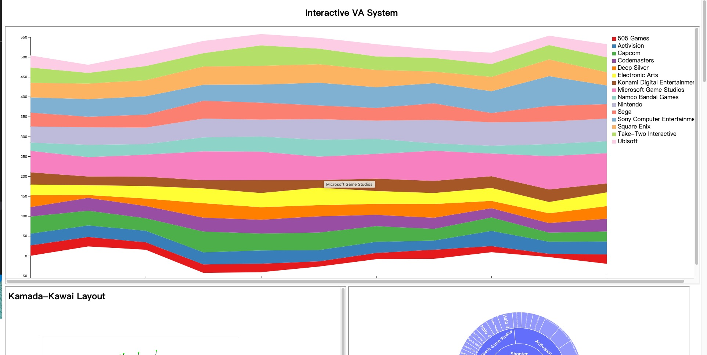
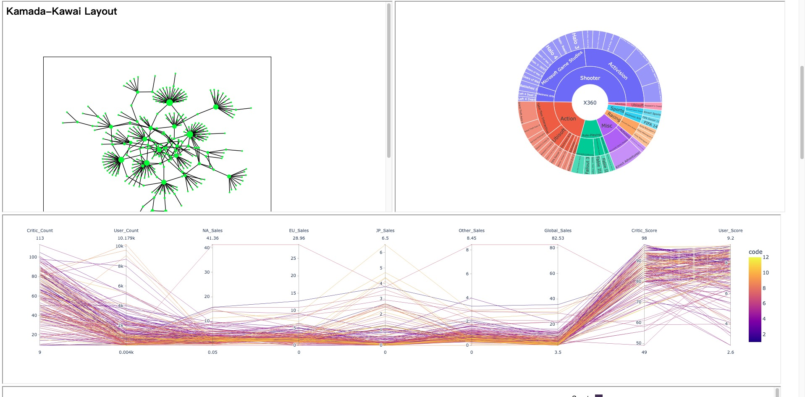
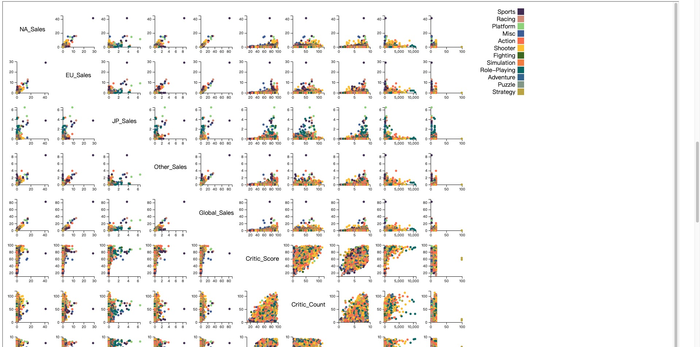
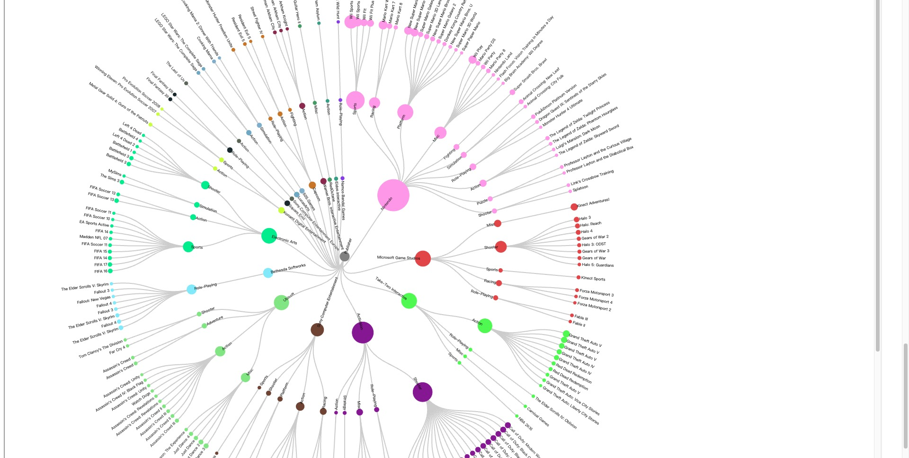

# Description
This project is designed to generate a streamlined .html file for the easy deployment of an interactive visual analytic system. Written in Python, it launches a web browser to showcase the results upon execution. The project leverages several Python packages including Pandas for I/O and preprocessing operations, along with Matplotlib, NetworkX, and Plotly for data visualization. Furthermore, D3.js, a JavaScript library, is utilized to generate extraordinary visualizations.

#Python files contents
'**main.py**': the main program.

'**preprocess.py**': Utilizes Pandas to read the original dataset and generates a subset which is subsequently stored as a .csv file or a smaller dataframe from the original dataset.

'**d3.py**': Incorporates D3.js syntax within the Python scripts to create multiple remarkable graphs

'**interact.py**'：Employs Plotly.express to create interactive plots.

'**netx.py**': Uses NetworkX to visualize graph data and implement certain graph data analysis tasks.

# Data
The original dataset is a publicly available dataset published on the Kaggle platform: [Original data source](https://www.kaggle.com/datasets/thedevastator/global-video-game-sales-ratings).

After performing several preprocessing steps, we generate a new dataset which is stored in'**dataset.csv**'.

# Instructions
The setup process is straightforward. Simply download the dataset stored in '**dataset.csv**', the main program file '**VASys.py**', and several other modules we have developed to be invoked in the main program, such as '**d3.py**', '**interact.py**', and '**netx.py**'. Once you have these, executing VASys.py will generate the necessary files and launch our visual analytic system in your web browser.

We have designed these functions to maximize generalization potential, meaning you will likely only need to make minor adjustments to arguments passed into the functions to create your own visual analytic system. You can also adopt the general guidelines we have applied throughout the Python development process to design your own implementation.

# Screenshots of Visual Analytic System

# Requirements
Given considerations for package version compatibility, we've outlined the specific versions we've used in our implementation:

**Pandas**: 1.5.3

**Plotly**: 5.9.0

**NetworkX**: 2.8.4

**Matplotlib**: 3.7.1

